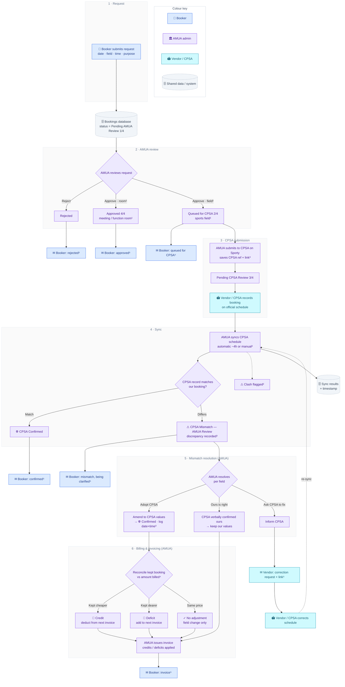

# Facility Booking — Data & Process Flow

An executive view of how a booking moves from request to invoice, and the data captured along the way.
Node **colour = who owns that step**: 🧑 Booker · 🏛 AMUA (admin) · 🏟 Vendor / CPSA. Grey = shared data/system. ✉ = a notification, coloured by who receives it. Superscripts ¹–⁵ point to the [Notes](#notes).

## Colour key

| Colour | Actor | Role |
|---|---|---|
| 🟦 Blue | **Booker** | A club member requesting a facility; receives notifications and invoices. |
| 🟪 Purple | **AMUA** | Auckland Mixed Ultimate (the club/admin) — reviews, submits, syncs, resolves, bills. Also runs the automated sync. |
| 🟦 Teal | **Vendor / CPSA** | The external facility authority that owns the official schedule (managed on "Sporty"). |
| ⬜ Grey | **Data / system** | Shared records: bookings DB, sync results, audit markers. |

## Flow

## Data captured

| Store | Holds |
|---|---|
| **Bookings DB** (Supabase) | the booking, its workflow status, and `system_notes` audit markers³ |
| **`system_notes` markers** | CPSA submission ref + Sporty link; original pre-amendment values; resolution outcome + billing state + **logged date & time**; the billed-amount snapshot |
| **Activity log** (Supabase) | every action (sign-in, email sent, settle, etc.), timestamped |
| **Sync results** (local) | per-month sync outcome with a `syncedAt` timestamp |
| **AMUA cart** (outbox) | all queued emails — sent only on submit⁵ |

## Notes

1. **Which bookings touch CPSA.** Only sports fields route through CPSA. Meeting/function rooms are approved directly by AMUA (status → *Approved 4/4*) and skip the CPSA submission, sync and confirmation steps.
2. **Sync & clashes.** AMUA's app re-syncs CPSA's official schedule automatically (roughly every 4 hours) or on demand. The same pass flags overlaps between AMUA/admin bookings and member bookings as *clashes* for AMUA to triage.
3. **Audit trail.** Each booking's `system_notes` carries the CPSA submission reference and Sporty link, the original values before any amendment, and the resolution marker — outcome, billing state, and the **date *and time*** it was logged. The amount billed is snapshotted so later drift can be reconciled.
4. **Billing reconciliation.** Adjustments are measured on the values AMUA **keeps** versus the amount already billed: kept booking cheaper ⇒ a **credit** to the booker; dearer ⇒ a **deficit** added; identical price ⇒ **no adjustment** (e.g. a swap to a same-rate field). Credits and deficits flow into the booker's next invoice.
5. **Notifications.** Every email is queued into AMUA's single "cart" outbox and sent only when AMUA submits; a *silent mode* switch can mute sending. Delivery is via a Supabase Edge Function → EmailJS, so no email credentials ship in the browser. Emails to the **booker** cover approval/queue/confirm/reject, mismatch notices and invoices; the one email to a **vendor** is the *Inform CPSA* correction request.

---
*Definitions —* **Booker:** a club member requesting a facility. **AMUA:** Auckland Mixed Ultimate, the club/admin running the system. **Vendor / CPSA:** the external facility authority whose official schedule lives on "Sporty"; *Inform CPSA* emails a specific vendor contact to correct it.
