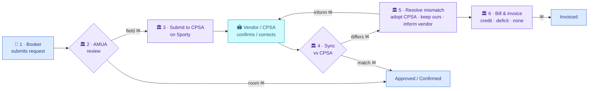

# Booking workflow — at a glance

**One line:** Booker request → AMUA review → submit to CPSA (Sporty) → sync vs CPSA → resolve any mismatch → bill & invoice.
**Owners:** 🟦 Booker · 🟪 AMUA (admin) · 🟦 Vendor / CPSA &nbsp;|&nbsp; ✉ = notification

**Talking points**
- Only **sports fields** go through CPSA; meeting/function rooms are approved directly.
- Sync runs **automatically (~4h)** or on demand, and also flags booking **clashes**.
- Mismatches are resolved **per field** — adopt CPSA's value, keep ours, or ask the vendor to correct CPSA.
- Billing adjusts on the **booking we keep** vs the amount billed: cheaper → **credit**, dearer → **deficit**, same → **no change**.
- All emails route through AMUA's single outbox (sendable/mutable) → booker (status, mismatch, invoice) and vendor (correction request).

> Full detail: see [`booking-data-flow.md`](./booking-data-flow.md).
